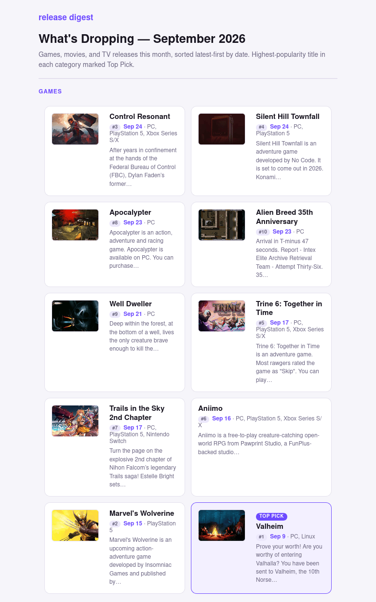

# release-digest

A monthly email digest of upcoming **games, movies, and TV** — sourced from
[RAWG](https://rawg.io/apidocs) and [TMDB](https://www.themoviedb.org/), ranked by each
API's own popularity signal, with posters embedded so they display without a
"load remote images" prompt.

<p align="center">
  
</p>

No inbound port, no database. The container runs in either of two modes:

| Mode | Behaviour | Suits |
|---|---|---|
| `scheduler` *(default)* | Stays up, fires the digest once a month | Docker Compose, Dockge, Portainer — anything expecting a service to stay running |
| `once` | Runs the digest immediately and exits | systemd timers, cron, manual runs |

## What it does

1. **Fetch** — pulls the target month's releases from RAWG (games) and TMDB (movies + TV).
2. **Rank** — sorts each category latest-first by release date, badges each card with its
   popularity rank within that category, and flags the top one as **Top Pick**.
3. **Render** — builds an email-safe HTML digest.
4. **Send** — emails it over Gmail SMTP with every poster embedded as an inline attachment.

## Quick start

A prebuilt image is published to `ghcr.io/devttyac/release-digest:latest`, so there's
nothing to compile.

```bash
git clone https://github.com/devttyac/release-digest.git
cd release-digest
cp .env.example .env && nano .env     # five values
chmod 600 .env
```

```bash
# Single run. `once` matters — without it you get the scheduler, which idles.
docker run --rm --env-file .env ghcr.io/devttyac/release-digest:latest once

# Same, but builds the message without sending.
docker run --rm --env-file .env -e DRY_RUN=1 ghcr.io/devttyac/release-digest:latest once
```

To run it on a schedule instead, see [deploy/README.md](deploy/README.md).

Without Docker:

```bash
python3 -m venv .venv && ./.venv/bin/pip install -r requirements.txt
./.venv/bin/python fetch_releases.py          # -> /tmp/release-digest-data.json
./.venv/bin/python send_digest.py --dry-run
```

## Configuration

All configuration lives in `.env` (see [.env.example](.env.example)): a TMDB key, a RAWG
key, a Gmail address, a Gmail **App Password**, and a recipient. Nothing is read from
command-line arguments, so credentials never land in shell history.

`DIGEST_RECIPIENT` takes one address or a comma-separated list. An entry that can't be
parsed is reported and skipped rather than silently dropped, so one typo can't quietly
stop a recipient receiving the digest.

The TMDB value must be the **API Key (v3 auth)** — 32 hex characters — not the longer
"API Read Access Token" shown beneath it, which is for a different auth scheme and fails
with `Invalid API key`.

Runtime knobs (`DIGEST_MONTH`, `ARCHIVE_DIR`, `DRY_RUN`, `TZ`, `RUN_DAY`, `RUN_HOUR`,
`RUN_MINUTE`, `RUN_ON_START`, `STATE_FILE`) are documented in
[deploy/README.md](deploy/README.md).

## Scheduling

[compose.yaml](compose.yaml) runs the scheduler as a service — the simplest option, and
what a stack manager expects. [deploy/](deploy/) additionally ships a systemd service +
timer and a crontab line for driving `once` mode externally.

The scheduler keeps a small state file recording the month it last sent. That gives it
three properties worth knowing:

- **No resend** after a container restart.
- **Catch-up** — if the host was down on the 1st and returns on the 5th, that month still
  goes out.
- **No send on first boot** — it seeds state and waits for the next month, so deploying
  never fires an unexpected email. `RUN_ON_START=1` overrides this for a test.

It refuses to start if the state directory isn't writable, rather than running without
those guarantees.

## Design notes

Most of the non-obvious decisions here were forced by how email clients actually behave,
and are worth knowing before "simplifying" them:

- **No `<style>` block.** Every style is inlined per element. Proton Mail strips `<style>`
  entirely, which silently flattens the whole design to unstyled HTML.
- **Light theme, not dark.** Clients routinely drop `background` on `body` and containers
  but keep text colors. A dark design degrades to near-white text on white; a light one
  stays readable no matter what the sanitizer removes.
- **Tables, not CSS Grid or flexbox**, for multi-column layout.
- **Posters embedded as inline `cid:` attachments.** Remote images are blocked by default
  in most clients, because loading them reveals that the reader opened the message.
  Embedding removes the external fetch, so there's nothing left to block.
- **Small CDN image variants** (`w185` for TMDB, `/media/resize/420/-/` for RAWG). The
  originals pushed a single email to 6.8MB; these bring it to roughly 1MB.
- **Image fetches are host-allowlisted** to the two CDNs over HTTPS. The URLs come from
  third-party API responses, which are untrusted input — an allowlist keeps a crafted
  entry from turning the sender into an SSRF vector.
- **Image type is sniffed from magic bytes**, not the `Content-Type` header, because TMDB
  sometimes omits the header and valid posters would otherwise be dropped.
- **Popularity shows as a rank, not a raw score.** RAWG's `added` is a count of users who
  added the game; TMDB's `popularity` is an opaque float that changes daily. Printing both
  would invite a comparison that means nothing — a game at 4,981 against a film at 230 is
  not 20x more popular. A per-category rank is comparable and answers the question a
  reader actually has, given the cards are ordered by date rather than by popularity.

## Layout

```
fetch_releases.py   fetch -> clip to month -> dedupe -> rank        -> JSON
render_digest.py    JSON -> email-safe HTML (inline styles, tables)
send_digest.py      render, embed posters as cid: parts, send via SMTP
scheduler.py        long-running mode: fires monthly, tracks what it sent
entrypoint.sh       dispatches `scheduler` (default) or `once`
compose.yaml        the scheduler as a service, for a stack manager
Dockerfile          the image both modes run from
deploy/             systemd units, cron line, deployment guide
```

Each stage runs independently, which is what makes it debuggable: run
`fetch_releases.py` alone to inspect the JSON, `render_digest.py` to get the HTML
without sending, or `send_digest.py --dry-run` to build the entire message and
report its size while sending nothing.

## License

MIT — see [LICENSE](LICENSE).
